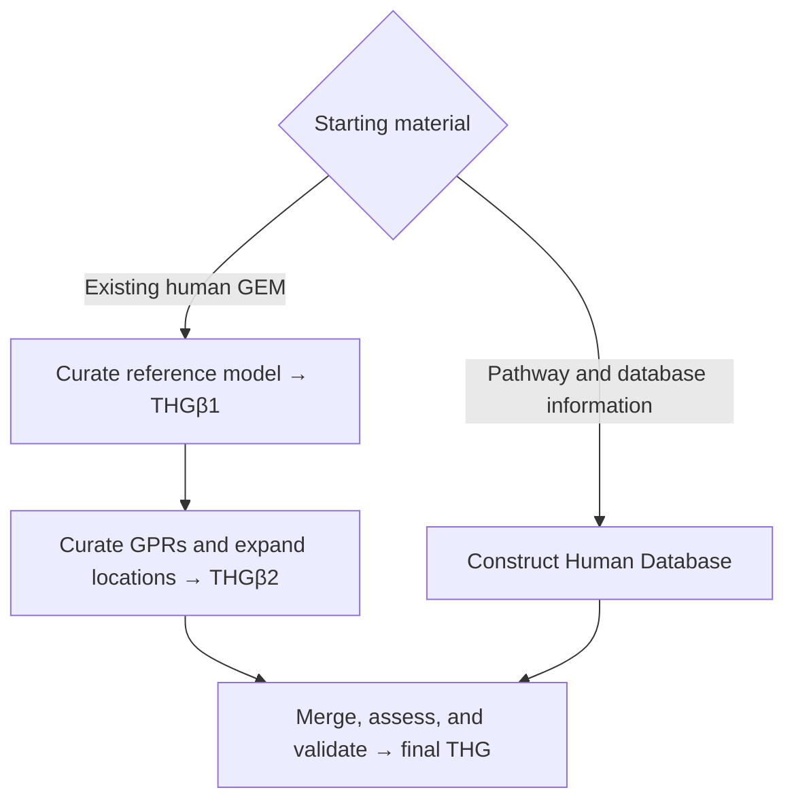

# THG Protocol

THG Protocol supports the construction, curation, expansion, and validation of
human genome-scale metabolic models (GEMs). The published strategy starts from
Human1 or another reference GEM, builds a complementary Human Database, and
converges on a validated THG model; the current package exposes maintained
building blocks for that strategy.

## Workflow entry points

### Existing human GEM

The [reference-model route](protocol/reference-model.md) applies when the
input is a JSON or SBML model such as Human1. It explains annotation,
mass-balance, GPR/location, and isoenzyme-expansion checkpoints and maps each
step to the current package. This is the closest package mapping to the
publication's reference-model branch.

### Pathway/database records

The [Human Database route](protocol/human-database.md) applies to human
pathway records or normalized metabolite and reaction records. The current
deterministic reconstruction API consumes normalized records; live harvesting
orchestration from online sources is recorded as Not implemented; see the
[capability and evidence matrix](protocol/implementation-status.md).

### Individual operation

The [operation reference](usage.md) covers annotation, model reconstruction,
pathway addition, gapfill, merge, comparison, figures, and cell-specific
reduction without requiring the complete protocol.

## How the complete protocol fits together

The two branches are conceptual model states from the publication. The current
package can compose several of the steps, but does not provide one command that
regenerates the published artifact.

The left branch begins with an existing human GEM such as Human1. Reference
annotation and mass-balance curation conceptually produce THGβ1; GPR/location
curation and isoenzyme-based expansion produce THGβ2. The other branch gathers
human pathway and online biological information into the Human Database/network.
Those products converge during merge. Connectivity, formula-balance, and
stoichiometric-consistency checks can be performed with package analysis APIs;
MEMOTE is an external assessment. See the [canonical protocol overview](protocol/index.md)
for the full map and its support boundaries.

## Outputs

Depending on the workflow branch, outputs include a curated or reconstructed
model in JSON/SBML, annotation and merge reports, deterministic comparison or
connectivity reports, service caches, and (when separately installed) a MEMOTE
HTML report. Output paths and cache ownership belong to the caller; preserve
the input model and provenance metadata alongside generated results.

## Requirements

| Requirement | Why it matters |
| --- | --- |
| Python 3.10–3.12 | Supported package runtime |
| Network access | Only service-backed lookups and live harvesting; local examples are offline |
| Credentials | BioCyc or other services only when the selected client requires them |
| Solver | Solver-backed checks and some downstream analyses; not needed for structural checks |
| Optional tools | MEMOTE, plotting, or cell-specific extras as selected by the route |

## Implementation status

Read the [published-protocol coverage matrix](protocol/implementation-status.md)
before treating a package operation as a complete reproduction of a published
stage. Maintainers should also consult `REFACTORING_PLAN_NEXT.md` in the
repository's `docs/plans/` directory for closeout requirements.

## Terms used in this site

A **GEM** is a genome-scale metabolic model. **THG** is the final Human GEM
concept from the publication; **THGβ1** and **THGβ2** are intermediate model
states for reference curation and GPR/location expansion. A **GPR** links genes
to reactions, while an **S-GPR** also represents stoichiometric protein
requirements. **Isoenzyme-based expansion** adds reaction instances for
compartment-specific enzyme activity. **Mass balance** checks elemental totals
across a reaction; **stoichiometric consistency** checks the model's
stoichiometric structure. **MEMOTE** is an external metabolic-model quality
assessment. A **metabolic task** is a defined functional test, and **gapfill**
adds selected reactions or transport links to address a structural gap.

For scientific context, see the [published protocol](https://doi.org/10.3390/bioengineering10050576).
