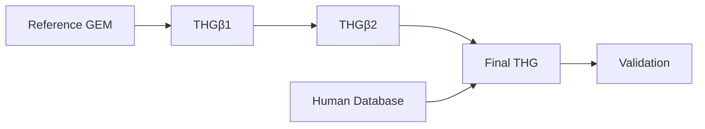

# THG Protocol

THG is a maintained Python package for constructing, curating, expanding, and
validating human genome-scale metabolic models (GEMs). It supports the
scientific workflow described by Marin de Mas et al. in the [2023 protocol
paper](https://doi.org/10.3390/bioengineering10050576), while keeping current
software behavior and publication-artifact reproduction as separate claims.

[Installation](installation.md) · [Quickstart](quickstart.md) · [Workflow overview](workflows/index.md)

Choose a route in the [workflow overview](workflows/index.md), run the small
offline [quickstart](quickstart.md), or consult the exact [I/O and configuration
contracts](reference/io-and-config.md).
