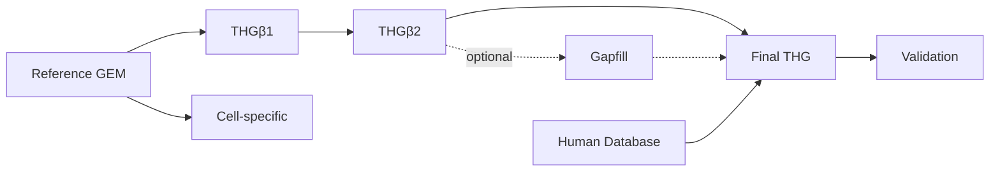

# THG Protocol

THG is a Python package and command-line toolkit for building and validating
human genome-scale metabolic models (GEMs).

[Installation](installation.md) · [Quickstart](quickstart.md) · [Workflow overview](workflows/index.md)

## Choose a starting point

- New here? Run the offline [quickstart](quickstart.md).
- Have a model or evidence ready? [Choose a workflow](workflows/index.md).
- Looking for exact options? Use the [CLI](reference/cli.md) or
  [configuration reference](reference/io-and-config.md).

## How the main workflows fit together

THG implements the workflow described in the [2023 protocol
paper](https://doi.org/10.3390/bioengineering10050576). Reproducing a published
artifact also requires the original inputs, configuration, and provenance.
