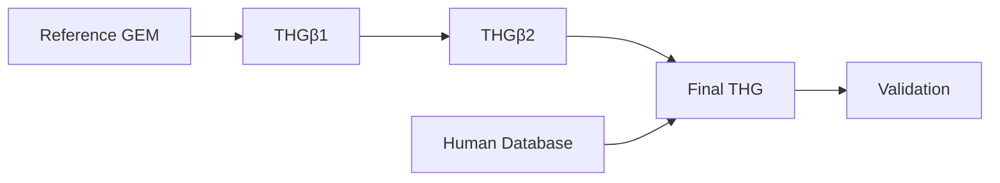

# THG Protocol

THG is a maintained Python package for constructing, curating, expanding, and
validating human genome-scale metabolic models (GEMs). It supports the
scientific workflow described by Marin de Mas et al. in the [2023 protocol
paper](https://doi.org/10.3390/bioengineering10050576), while keeping current
software behavior and publication-artifact reproduction as separate claims.

[Install THG](installation.md) · [Run the quickstart](quickstart.md) · [Choose a workflow](workflows/index.md)

## What you can do

- Curate a reference human GEM with THGβ1.
- Expand it using GPR and localization evidence with THGβ2.
- Reconstruct a Human Database from normalized records.
- Merge branches and validate a final THG candidate.
- Compare models and use pathway, gapfill, annotation, and cell-specific tools.

Start with the [workflow overview](workflows/index.md) for the scientific
lifecycle, or use the [reference](reference/io-and-config.md) for exact
interfaces and file contracts. THG does not claim exact reproduction of a
publication artifact unless a page explicitly identifies the separately
verified evidence.

Historical migration evidence is retained outside the published navigation;
the closeout record is `REFACTORING_PLAN_NEXT.md`.
