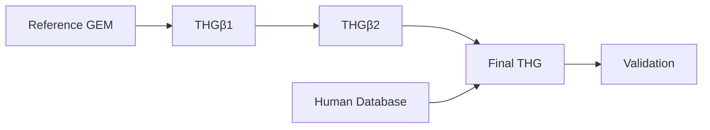

# THG Protocol

THG is a maintained Python package for constructing, curating, expanding, and
validating human genome-scale metabolic models (GEMs). It supports the
scientific workflow described by Marin de Mas et al. in the [2023 protocol
paper](https://doi.org/10.3390/bioengineering10050576), while keeping current
software behavior and publication-artifact reproduction as separate claims.

[Installation](installation.md) · [Quickstart](quickstart.md) · [Workflow overview](workflows/index.md)

## Supported workflows and operations

- Reference-model curation with THGβ1.
- GPR and localization expansion with THGβ2.
- Human Database reconstruction from normalized records.
- Branch merging and validation for final THG candidates.
- Model comparison, pathway implementation, gap filling, annotation, and
  cell-specific analysis.

The [workflow overview](workflows/index.md) describes the scientific lifecycle.
The [reference](reference/io-and-config.md) defines exact interfaces and file
contracts. THG does not claim exact reproduction of a publication artifact
unless a page explicitly identifies the separately verified evidence.

Historical migration evidence is retained outside the published navigation;
the closeout record is `REFACTORING_PLAN_NEXT.md`.
