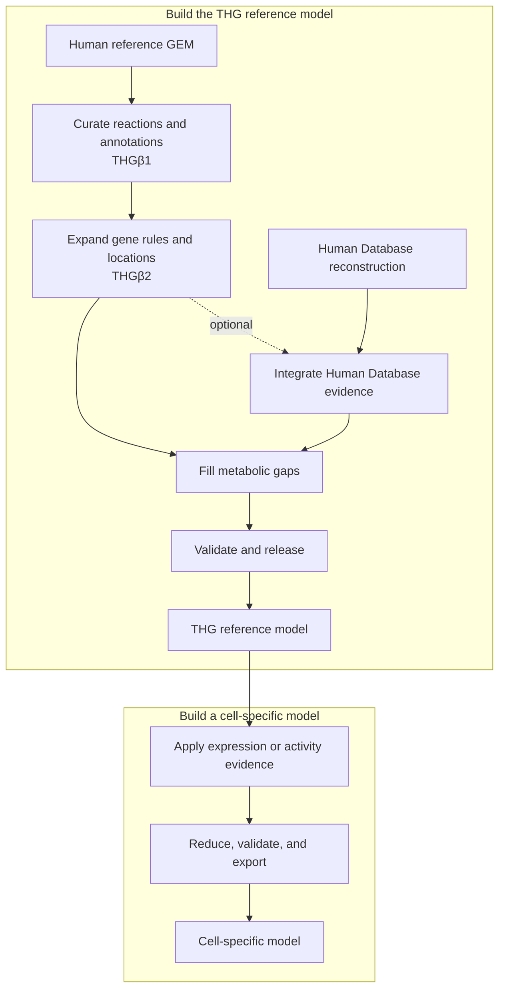

# THG Protocol

THG is a Python package and command-line toolkit that turns a general human
genome-scale metabolic model (GEM) into a curated reference model, then derives
cell-specific models from gene-expression or activity evidence. Each workflow
records validation results, checksums, and provenance so the model's lineage can
be inspected and reproduced.

[Installation](installation.md) · [Quickstart](quickstart.md) · [Workflow overview](workflows/index.md)

## Choose a starting point

- New here? Run the offline [quickstart](quickstart.md).
- Have a model or evidence ready? [Choose a workflow](workflows/index.md).
- Looking for exact options? Use the [CLI](reference/cli.md) or
  [configuration reference](reference/io-and-config.md).

## What THG does

The reference workflow curates model content, expands biological evidence,
optionally integrates the Human Database, fills network gaps, and applies the
final validation boundary. The cell-specific workflow preserves that parent
model while selecting the reactions supported by a tissue or cell's evidence.

See the [workflow overview](workflows/index.md) for the available commands and
the current release-handoff boundary, or go directly to the
[cell-specific workflow](workflows/cell-specific.md) when you already have a
released reference model.

THG implements the workflow described in the [2023 protocol
paper](https://doi.org/10.3390/bioengineering10050576). Reproducing a published
artifact also requires the original inputs, configuration, and provenance.
