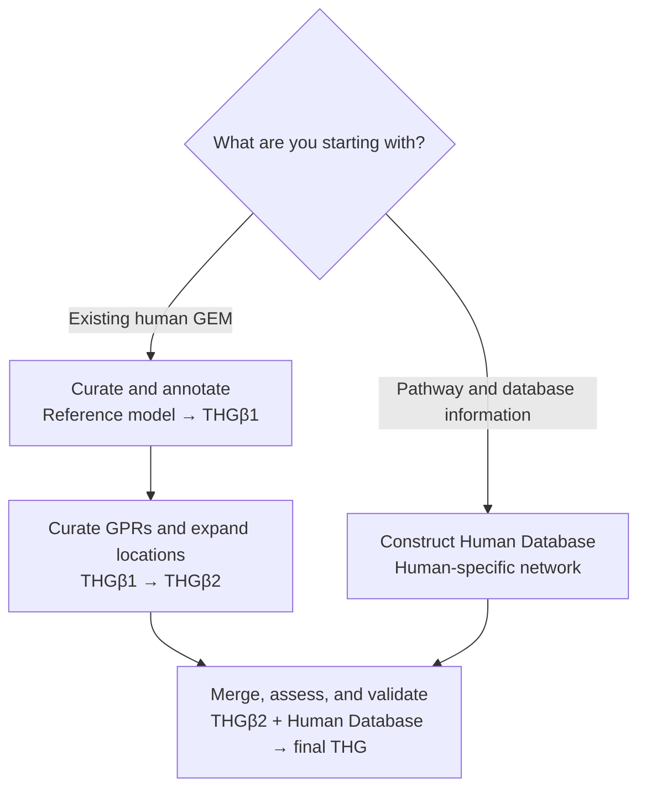

# THG documentation restructuring: implementation brief

## Instructions to the implementation agent

You are updating the documentation for the THG Protocol repository:

- Current/refactored repository: `norle/THG_The-Human-GEM-protocol-standalone`
- Expected working branch: `refactoring-cleanup` unless the local checkout says otherwise
- Pre-refactor repository used as historical evidence: `MarindeMasLab/THG_The-Human-GEM-protocol`
- Published protocol: *A Protocol for the Automatic Construction of Highly Curated Genome-Scale Models of Human Metabolism*, DOI `10.3390/bioengineering10050576`

The goal is not merely to rewrite prose. The goal is to reorganize the documentation around the scientific workflow a researcher is trying to complete.

The current documentation describes many individual operations, but it does not make the intended end-to-end THG workflow clear. It presents the software as a flat collection of optional tools. The published protocol, however, has two branches that converge:

1. curate and expand an existing reference GEM;
2. independently construct a Human Database/network from pathway and database information;
3. merge the two products;
4. assess and validate the merged result;
5. produce the final THG model.

The revised site must separate these two concepts:

- **Run the THG protocol**: the staged scientific workflow described by the publication.
- **Use an individual operation**: annotation, reconstruction, pathway addition, gapfill, comparison, figures, cell-specific reduction, and similar modular tools.

Do not invent scientific functionality. Some historical workflows are archived or only partially replaced. Verify the current package and tests before describing a workflow as supported. When a complete published step is not currently available through a supported package API or CLI, state that clearly.

Do not change scientific algorithms or package behavior as part of this task. Changes should be limited to documentation, MkDocs configuration, documentation assets, and small documentation tests if needed. Do not commit, push, open a pull request, or deploy unless separately authorized.

---

## 1. Required preliminary inspection

Before editing anything:

1. Read any applicable `AGENTS.md` files completely.
2. Run `git status --short` and preserve all unrelated user changes.
3. Inspect:
   - `mkdocs.yml`
   - `docs/index.md`
   - `docs/quickstart.md`
   - `docs/usage.md`
   - `docs/workflow-overview.md`
   - `docs/architecture.md`
   - every file under `docs/workflows/`
   - `docs/data-and-model-files.md`
   - `docs/legacy-workflows.md`
   - `docs/legacy-api-inventory.md`
   - `docs/api-contracts.md`
   - `docs/repository-map.md`
   - `README.md`
   - `pyproject.toml`
   - the documentation CI workflow under `.github/workflows/`
4. Inspect the relevant package APIs and their tests. In particular, verify the actual behavior and available examples for:
   - `thg_protocol.annotation`
   - `thg_protocol.model_build`
   - `thg_protocol.database`
   - `thg_protocol.gpr`
   - `thg_protocol.merge`
   - `thg_protocol.analysis`
   - `thg_protocol.gapfill`
   - `thg_protocol.pathway`
   - `thg_protocol.cell_specific`
   - `thg_protocol.figures`
5. Use `rg` to find all links to pages that will be renamed, moved, or substantially repurposed.
6. Inspect the current tests/fixtures and example files before selecting input files for tutorials. Do not refer to a fixture or configuration that does not exist.

Use the repository's own source, contracts, tests, and legacy inventory as the authority for current implementation status. Use the publication and pre-refactor README as the authority for the intended scientific workflow.

---

## 2. Product and editorial decisions

Apply these decisions consistently throughout the site.

### 2.1 The protocol is the primary story

The published THG workflow is the primary conceptual model. The documentation must explain what the protocol accomplishes before presenting Python functions.

Every core protocol page must explain:

- why the stage exists scientifically;
- what model/data state enters the stage;
- what changes during the stage;
- what artifact leaves the stage;
- how the user checks that it succeeded;
- what the next stage is;
- whether the complete stage is currently supported, partial, external, or archived.

### 2.2 Modular tools remain available, but are secondary

The existing operation guides are still useful. Keep them, improve them, and group them under **Individual operations**. Do not present gapfill, figures, cell-specific modelling, or comparison as mandatory stages in every THG construction.

### 2.3 Software modularity is not the same as workflow optionality

Avoid generic claims such as “every stage is optional.” Individual functions may be callable independently, but a researcher following the published THG protocol must complete particular stages. Use more precise language:

> THG operations can be called independently. To reproduce the published construction strategy, follow the staged protocol shown below.

### 2.4 Be explicit about implementation status

Use the following status vocabulary only:

| Status | Meaning |
| --- | --- |
| **Supported** | A maintained package API or installed CLI exists and is covered by current tests. |
| **Partial** | Maintained building blocks exist, but no supported end-to-end orchestration reproduces the complete published stage. |
| **External** | The step is performed with a separately installed tool, such as MEMOTE. |
| **Archived** | Historical code or research workflow is recorded but is not a supported current interface. |

Do not use **Experimental** unless the repository itself identifies the capability as experimental.

Every protocol page must have a prominent status callout near the beginning. The status must be based on current code, tests, `docs/legacy-api-inventory.md`, and `docs/api-contracts.md`—not on similar function names.

### 2.5 Distinguish scientific reproduction from a software demonstration

A two-metabolite toy model is a valid API smoke test. It is not a representative THG quickstart. Rename or relocate the existing toy tutorial accordingly.

The new practical quickstart should mirror a real user journey using small deterministic fixtures. It must not claim to reproduce a research-quality human GEM.

---

## 3. Canonical workflow diagram

Add a Mermaid diagram equivalent to the following on:

- `docs/index.md`, as a compact version; and
- the canonical protocol overview page, as the main version.

The diagram must render in the built MkDocs site. Do not leave it as an unrendered fenced code block.



If HTML line breaks do not render correctly in the configured Mermaid version, replace them with short single-line labels. Preserve the two-branch structure and convergence.

The surrounding prose must explain:

- the left/reference branch begins with an existing human GEM such as Human1;
- reference annotation and mass-balance curation produce the THGβ1 stage;
- GPR/location curation and isoenzyme-based expansion produce THGβ2;
- the other branch constructs a Human Database/network from human pathways and online biological information;
- the two branches converge during merge;
- MEMOTE/task assessment and stoichiometric consistency checks validate the result;
- current package support may differ from the complete historical/published process.

### Mermaid configuration

Inspect the existing MkDocs dependencies before changing configuration. Add the smallest supported Mermaid integration for the installed MkDocs Material version. A typical configuration uses `pymdownx.superfences` with a `mermaid` custom fence and loads Mermaid JavaScript. Do not blindly paste configuration that the current environment cannot build.

Requirements:

1. `mkdocs build --strict` must pass.
2. The generated HTML must contain the Mermaid diagram container and the required script/init code.
3. If the project has preview tooling, visually verify that the diagram renders in light and dark mode.
4. Do not introduce a build-time network dependency.
5. If a CDN runtime script is used, document that choice in the documentation-contribution guide. Prefer an existing project convention if one exists.

---

## 4. Target navigation

Restructure `mkdocs.yml` so that the navigation reflects user journeys. Use the following structure unless existing files or compatibility constraints require a small adjustment:

```yaml
nav:
  - Home: index.md

  - Start here:
      - Installation: installation.md
      - Choose your route: workflow-overview.md
      - Practical quickstart: quickstart.md
      - API smoke test: api-smoke-test.md

  - Run the THG protocol:
      - Complete workflow: protocol/index.md
      - Curate an existing GEM: protocol/reference-model.md
      - Construct the Human Database: protocol/human-database.md
      - Merge and validate: protocol/merge-and-validate.md
      - Worked end-to-end example: protocol/end-to-end-example.md
      - Published protocol coverage: protocol/implementation-status.md

  - Individual operations:
      - Choose an operation: usage.md
      - Model reconstruction: workflows/database.md
      - Model enrichment: workflows/model-build.md
      - Annotation and identification: workflows/annotation.md
      - Pathway implementation: workflows/pathway.md
      - Gapfill: workflows/gapfill.md
      - Merge: workflows/merge.md
      - Network analysis: workflows/network-analysis.md
      - Model comparison: workflows/comparison.md
      - MEMOTE and task analysis: workflows/memote.md
      - Cell-specific models: workflows/cell-specific.md
      - Figures and reports: workflows/figures.md

  - Reference:
      - Inputs, outputs, and file formats: data-and-model-files.md
      - Examples: examples/README.md
      - Python and CLI overview: api/index.md
      - Core and I/O: api/core.md
      - Database and model construction: api/construction.md
      - Annotation and GPR: api/annotation.md
      - Services: api/services.md
      - Workflows: api/workflows.md
      - Analysis: api/analysis.md
      - Figures: api/figures.md
      - CLI commands: api/cli.md

  - Maintainers:
      - Development: development.md
      - Documentation contribution: documentation-contributing.md
      - Release validation: release-validation.md
      - Dependency compatibility: dependency-compatibility.md
      - Repository map: repository-map.md
      - Tracked artifact inventory: artifact-inventory.md
      - Service boundary audit: service-boundary-audit.md
      - Git LFS standalone repository: git-lfs-standalone-repository.md
      - Python API contracts: api-contracts.md
      - Legacy workflow status: legacy-workflows.md
      - Legacy API inventory: legacy-api-inventory.md
```

The exact number of reference/API pages may remain unchanged. The important requirements are:

- one obvious **Start here** sequence;
- one dedicated **Run the THG protocol** section;
- modular utilities under **Individual operations**;
- repository, release, LFS, legacy, and API-contract records under **Maintainers**;
- no repository-maintenance policy in **Start here**.

Do not delete useful maintainer records merely to shorten the navigation.

---

## 5. Page-by-page implementation requirements

### 5.1 `docs/index.md` — rewrite the home page

The first screen must answer four questions:

1. What is THG Protocol?
2. What can I start with?
3. What output can I obtain?
4. Where should I click first?

Required structure:

```markdown
# THG Protocol

One short paragraph describing construction, curation, expansion, and validation
of human genome-scale metabolic models.

## Choose your starting point

### I have an existing human GEM — recommended
Two or three sentences and a link to the reference-model route.

### I want to construct a network from pathway/database information
Two or three sentences and a link to the Human Database route.

### I need only one operation
Link to the individual-operation chooser.

## How the complete protocol fits together
Compact Mermaid diagram.

## What you will produce
Short explanation of models, reports, caches, and validation outputs.

## Before you begin
Small requirements table: Python, network, credentials, solver, optional tools.

## Implementation status
Link to the published-protocol coverage matrix.
```

Do not lead with a long feature list. Do not present five equally important “start here” links. Recommend the existing-model route because it mirrors the Human1 use case in the publication, while keeping the database-construction route visible.

### 5.2 `docs/workflow-overview.md` — make it the route chooser

Replace the current flat operation categorization with a decision-oriented page.

Required content:

- the reader's three choices: existing GEM, pathway/database information, or one standalone operation;
- a concise input/output comparison table;
- links to the exact next page for each route;
- a note distinguishing the published workflow from independent package operations;
- dependency expectations for each route;
- no duplicated list of every Python function.

Recommended table:

| Starting point | Recommended route | Main output | Typical external requirements |
| --- | --- | --- | --- |
| Existing JSON/SBML human GEM | Curate and expand a reference GEM | THGβ1-/THGβ2-like revised model and reports | Biological services; BioCyc credentials for applicable lookups |
| Human pathway/database records | Construct the Human Database | Human-specific metabolic network | Normalized records or supported service clients |
| Two prepared model branches | Merge and validate | Final merged model and validation reports | Solver/MEMOTE for selected checks |
| One local task | Individual operation | Operation-specific model/report | Depends on operation |

Use “THGβ1-like” or “THGβ2-like” if the current package does not formally emit those named artifacts. Do not imply exact publication reproduction without evidence.

### 5.3 `docs/quickstart.md` — replace with a representative quickstart

The quickstart must demonstrate a realistic small workflow, not just object construction.

Preferred sequence:

1. install the package;
2. copy or load a small existing JSON/SBML fixture;
3. inspect annotations or structure;
4. apply one deterministic curation/enrichment step using static/offline data;
5. run balance or connectivity checks;
6. compare the original and revised model;
7. display the exact output files;
8. link to the full protocol overview.

Constraints:

- It must run without live credentials or an online service.
- Every variable must be defined.
- Every referenced fixture must exist in a stable, documented path.
- Commands must work from a fresh checkout after following the installation instructions.
- Show expected output values or at least stable output filenames.
- Clearly state that this is a small software demonstration, not a research-quality human reconstruction.
- Prefer an installed CLI for the main path when an appropriate CLI exists. Include Python only where there is no suitable CLI or where it materially helps.

If no existing fixture can support a representative sequence, create a small documentation fixture under an appropriate examples/fixtures location and add a focused test that executes the documented code path. Do not copy a large model into the documentation.

### 5.4 `docs/api-smoke-test.md` — preserve the existing toy example

Move the current two-metabolite reconstruction example from `quickstart.md` to this new page. Improve it only as needed to remain runnable.

The introduction must say:

> This smoke test verifies installation, model reconstruction, output writing, and a local balance check. It does not represent the complete THG scientific workflow.

Update incoming links from the README or other pages so they distinguish the practical quickstart from the API smoke test.

### 5.5 `docs/protocol/index.md` — create the canonical protocol overview

This is the most important new page.

Required sections:

1. **Purpose and intended audience**
2. **The complete workflow** with the main Mermaid diagram
3. **The two construction branches**
4. **Intermediate model states**
5. **Merge and validation loop**
6. **Requirements by stage**
7. **Current implementation status**
8. **Where to start**

Include an intermediate-state table:

| Stage | Starting material | Main transformation | Result in the publication |
| --- | --- | --- | --- |
| Reference curation | Existing human GEM, such as Human1 | Improve identifiers/annotation and correct mass-balance issues | THGβ1 |
| GPR/location expansion | Curated reference model | Curate GPRs and add compartment-specific isoenzyme reactions | THGβ2 |
| Human Database construction | Human pathway and online database information | Build a human-specific network with metabolites, reactions, genes, GPRs, and compartments | Human Database |
| Merge | THGβ2 and Human Database | Identify overlap and combine compatible content | Merged candidate THG |
| Assessment and consistency | Merged candidate | MEMOTE, essential tasks, and stoichiometric consistency checks | Final THG |

Explain that the publication uses the intermediate names as model states. If the refactored package does not name outputs that way, say so explicitly and use those names only for conceptual mapping.

### 5.6 `docs/protocol/reference-model.md` — create the existing-GEM route

This page should join currently fragmented annotation/model-build/GPR steps into a coherent user journey.

Required sections:

- status callout;
- scientific outcome;
- acceptable starting formats;
- annotation/identifier inspection;
- metabolite and reaction identification;
- mass-balance treatment;
- GPR and cellular-location curation;
- isoenzyme/compartment expansion;
- expected outputs and caches;
- validation checkpoint;
- transition to merge;
- links to detailed individual-operation pages.

Use a numbered procedure. If there is no supported single command for the entire route, say that it is composed from multiple APIs and give the verified sequence. Do not imply a nonexistent `thg run` command.

Clearly explain which steps can run offline, which use injected clients, and which may require BioCyc credentials or network access.

### 5.7 `docs/protocol/human-database.md` — create the database branch

This page must resolve the ambiguity between:

- reconstructing from already normalized local records; and
- the publication's live construction of a Human Database from pathway and online database information.

Required sections:

- status callout;
- what “Human Database” means in the publication;
- the published input: a list of human metabolic pathways;
- information gathered for metabolites, reactions, genes, GPRs, and compartments;
- current supported input forms: normalized records, JSON bundles, applicable clients, and historical pickle adapters;
- exact JSON record schema with a minimal valid example;
- supported reconstruction example;
- explicit “current limitation” section describing any absent/archived live harvesting orchestration;
- outputs and validation;
- transition to merge.

The current `docs/workflows/database.md` is allowed to remain a focused API/operation guide. This protocol page must explain the scientific branch and then link to the operation guide.

Do not claim that `reconstruct_model` queries KEGG, BioCyc, PubChem, or other services if it only consumes normalized records.

### 5.8 `docs/protocol/merge-and-validate.md` — create the convergence route

Required content:

- status callout;
- inputs from both branches;
- compatibility requirements;
- how overlap is identified in the publication;
- how the current merge API behaves;
- a prominent note about intentional migration differences;
- merge report fields or a link to their API reference;
- network connectivity and formula-balance checks;
- stoichiometric consistency;
- MEMOTE invocation;
- metabolic-task status;
- acceptance checklist;
- final output and provenance requirements.

Do not conflate these different activities:

- structural model merge;
- comparison/diff;
- connectivity analysis;
- reaction formula balance;
- stoichiometric consistency;
- MEMOTE assessment;
- essential metabolic-task analysis.

Explain which are package operations, which are external, and which are currently archived.

Provide a final checklist such as:

- both inputs preserved unchanged;
- merge report reviewed;
- identifier collisions and retained stoichiometry understood;
- isolated-metabolite removal decision recorded;
- connectivity report reviewed;
- balance/consistency results saved;
- MEMOTE report saved when used;
- essential-task validation status recorded;
- final model serialized to a caller-selected path;
- package version, input model versions, service/cache dates, solver, and configuration recorded.

### 5.9 `docs/protocol/end-to-end-example.md` — create a worked example

Build a deterministic example that mirrors the workflow structure with small data.

The example must include:

- a directory/file tree before execution;
- exact installation assumptions;
- every command or Python script in execution order;
- every expected output file;
- at least one inspection checkpoint after each major stage;
- a final comparison or validation output;
- a clear statement of which publication steps are represented and which are omitted;
- a reproducibility note.

Do not pretend that a toy model plus static clients is equivalent to regenerating THG from live databases. Call it a **worked miniature of the workflow**.

If a full runnable miniature cannot cover both branches with current supported APIs, create a truthful partial example and link to the implementation-status matrix. Never insert pseudocode into a block labeled as a runnable command.

### 5.10 `docs/protocol/implementation-status.md` — create a coverage matrix

This page prevents documentation from overpromising functionality.

Start from the following matrix, then verify and correct every status using current code/tests:

| Published step | Likely current interface | Status to verify | Documentation requirement |
| --- | --- | --- | --- |
| Reference annotation and mass balancing → THGβ1 | `thg_protocol.annotation`, `thg_protocol.model_build` | Supported or Partial | Show the verified sequence and outputs. |
| Construct Human Database from live biological sources | `thg_protocol.database`, service clients, model-build helpers | Partial | Separate normalized reconstruction from live harvesting. |
| GPR/location curation and isoenzyme expansion → THGβ2 | GPR and model-build APIs | Supported or Partial | Demonstrate only behavior covered by tests. |
| Similarity/identity-aware merge | `thg_protocol.merge` | Supported with intentional differences | Link to API contracts and explain retained-base behavior. |
| Network and reaction checks | `thg_protocol.analysis` | Supported | State solver requirements per check. |
| MEMOTE assessment | external `memote` command | External | Provide install and invocation guidance. |
| Essential metabolic-task analysis | historical MEMOTE task code | Archived unless a maintained replacement exists | Do not present as supported. |
| Iterative merge/consistency loop | merge + consistency APIs | Partial unless an orchestrator exists | Describe manual composition if appropriate. |
| Reproduce the final published THG artifact | complete staged workflow | Partial unless demonstrated by a maintained test/runbook | State exact limitations. |

For each row, include:

- publication concept;
- current entry point;
- status;
- evidence: API/test/contract/legacy inventory;
- known behavioral difference;
- recommended user path.

Do not expose internal planning prose unnecessarily. Translate internal status into concise user-facing language.

### 5.11 `docs/usage.md` — keep only one operation chooser

Retain this page as the canonical chooser for standalone operations.

Improve its table with these columns:

| Goal | Operation | Input | Output | Status | Network/solver needs |

Add a short note for each operation indicating whether it commonly belongs to the core protocol, is a supporting operation, or is a downstream analysis.

Remove the second generic workflow ordering from this page. The protocol overview owns end-to-end order; this page owns task selection.

### 5.12 `docs/architecture.md` — reposition or merge

The current page repeats a low-information linear diagram. Choose one of these options:

- rewrite it as a developer-oriented architecture/data-boundary page and move it under Maintainers; or
- merge its useful content into the protocol overview and API reference, then leave a short compatibility page linking to the new locations.

Do not retain a second competing “overall workflow” diagram.

### 5.13 `docs/data-and-model-files.md` — rewrite for users

This page is currently mostly repository/LFS policy. Rewrite it as a user-facing reference.

Required sections:

- supported model formats and which operations support each;
- normalized metabolite/reaction record formats;
- pathway configuration format;
- activity/expression input formats;
- output model/report/cache conventions;
- caller-owned output directories;
- whether inputs are mutated;
- example output tree;
- reproducibility metadata to preserve;
- links to downloadable example files.

Move or link Git LFS and tracked-artifact policy to maintainer pages. Do not put advice about broad LFS rules in a user getting-started page.

### 5.14 Existing `docs/workflows/*.md` pages — expand using one template

Apply this exact template to each operation guide:

```markdown
# Operation name

!!! info "Status: Supported | Partial | External | Archived"
    One sentence explaining the status and current entry point.

## Outcome
What this operation changes or produces.

## Place in the THG protocol
Core stage, supporting operation, optional downstream analysis, or standalone tool.

## When to use it

## When not to use it

## Inputs
Exact formats, required fields, and a small example.

## Requirements
Core/optional extra, network, credentials, solver, and realistic runtime notes.

## Run from the command line
Complete runnable command if a maintained CLI exists.

## Run from Python
Complete runnable example with every variable defined.

## Outputs
Return object plus exact files/directories written.

## Inspect the result
What to look at and what indicates success.

## Common problems
Symptoms, likely causes, and next action.

## Next step
One or two specific links.

## Differences from the historical workflow
Only when material.
```

Do not force a CLI section onto an API-only operation. Say explicitly that no installed CLI exists.

Examples must be runnable or explicitly labeled **illustrative pseudocode**. Avoid undefined variables such as `base_model` without showing how they are loaded.

### 5.15 `docs/workflows/memote.md` — correct the capability claim

This page requires special attention.

Separate:

1. MEMOTE quality assessment, performed using the external `memote` command;
2. essential metabolic-task analysis used in the publication;
3. current package status of the historical task implementation.

If the legacy inventory remains authoritative and no maintained replacement exists, label metabolic-task analysis **Archived**. Do not title the page as though both MEMOTE and tasks are currently available through one supported THG workflow without explaining the distinction.

### 5.16 Root `README.md` — align with the revised site

Update the README after the site pages are stable.

Requirements:

- retain installation and a small smoke test;
- add the compact Mermaid workflow only if GitHub rendering and readability are good; otherwise include a concise text version and link to the rendered documentation diagram;
- distinguish “run the complete protocol” from “use one operation”;
- point to the practical quickstart, complete workflow, operation chooser, implementation-status matrix, and API reference;
- avoid duplicating the complete documentation.

---

## 6. Content rules

### 6.1 Use researcher-oriented language

Prefer:

> Start with an existing JSON or SBML model when you want to curate and expand a reference GEM.

Avoid:

> Use `build_model` for one model.

Introduce the outcome first, then the interface.

### 6.2 Define important terms once

Add a short glossary or inline definitions for:

- GEM
- THG
- Human1/reference model
- THGβ1
- THGβ2
- Human Database
- GPR
- S-GPR
- isoenzyme-based expansion
- mass balance
- stoichiometric consistency
- MEMOTE
- metabolic task
- gapfill

Do not assume that a Python user already knows the scientific model lineage.

### 6.3 Keep naming consistent

Use:

- **THG Protocol** for the project/toolset;
- **THG** for the final model concept;
- **Human Database** when referring to the publication's constructed network;
- **model reconstruction** for construction from normalized records;
- **model enrichment** for adding external biological information to an existing model;
- **annotation and identification** for inspecting/resolving identifiers and GPR information.

Do not alternate casually among “database,” “network model,” “Human Database,” and “reconstruction” without explaining the relationship.

### 6.4 Explain mutation and ownership

Each operation guide must say whether:

- the input model is mutated;
- a copy is returned;
- files are written only when an output path is supplied;
- caches or reports are created;
- retries can reuse caches;
- credentials are ever read.

Use current API contracts as the authority.

### 6.5 Explain external requirements precisely

Do not say merely “network may be required.” Name the operation that makes requests, the service involved where known, credential requirements, expected caching behavior, and whether an offline/static alternative exists.

Do not put real credentials in examples. Use environment-variable placeholders where supported.

### 6.6 Do not promise reproducibility from live services without caveats

The publication emphasizes current online information. That means results can change over time. Tell users to record:

- THG Protocol/package version and commit;
- input model version/checksum;
- pathway/configuration files;
- service query/cache dates;
- relevant database releases when available;
- solver and version;
- optional dependency versions;
- output report/model checksums.

---

## 7. Practical examples and file trees

Each major tutorial should show files before and after execution.

Example style:

```text
project/
├── inputs/
│   ├── reference-model.json
│   ├── pathway-records.json
│   └── pathway-config.json
└── results/
```

After execution:

```text
project/
├── inputs/
│   └── ...
└── results/
    ├── reference/
    │   ├── curated-model.json
    │   ├── annotation-report.json
    │   └── cache/
    ├── database/
    │   └── human-network.json
    ├── merge/
    │   ├── merged-model.xml
    │   └── merge-report.json
    └── validation/
        ├── components.json
        └── memote.html
```

Use actual filenames produced by the verified APIs. The tree above is illustrative; correct it before publishing.

---

## 8. Testing and verification

### 8.1 Build the documentation

Inspect the documentation CI workflow and use its exact environment and command. At minimum, run the equivalent of:

```bash
mkdocs build --strict
```

Do not guess an optional dependency extra. Read `pyproject.toml` and the CI workflow first.

### 8.2 Verify internal links

Use `rg` and the strict build to ensure:

- no links still treat the API smoke test as the practical quickstart;
- no links point to removed/moved files;
- every MkDocs nav target exists;
- every API cross-reference resolves;
- every relative link from new protocol pages is correct.

### 8.3 Execute examples

For every code block labeled as runnable:

- execute it in a clean temporary output directory;
- confirm exit status;
- confirm the claimed files exist;
- confirm stable expected values where shown;
- avoid live network calls in the default test.

Add or update focused tests for the practical quickstart and Mermaid configuration where appropriate. Do not add a large, slow, credentialed documentation test to the default suite.

### 8.4 Visual verification

Preview at least these pages:

- home;
- choose your route;
- complete workflow;
- practical quickstart;
- implementation-status matrix;
- one representative operation guide;
- MEMOTE/task page.

Verify:

- Mermaid renders rather than appearing as source text;
- the diagram is legible in light and dark themes;
- tables do not overflow badly;
- admonitions render correctly;
- navigation clearly separates Protocol, Individual operations, Reference, and Maintainers;
- no page begins with an overwhelming wall of links.

If browser preview is unavailable, inspect the generated HTML and report that visual browser verification was not performed.

### 8.5 Run relevant repository tests

Run the documentation tests and any focused API/example tests affected by the new quickstart. Do not claim the full project is green unless the full relevant suite was actually run.

---

## 9. Acceptance criteria

The task is complete only when all of the following are true:

### Entry and navigation

- A first-time reader can choose a starting route directly from the home page.
- The existing-GEM route is clearly recommended for the publication-like Human1 use case.
- “Run the THG protocol” and “Use an individual operation” are separate navigation sections.
- Maintainer/LFS/legacy/release records are not mixed into getting started.
- There is one canonical end-to-end workflow overview, not several competing generic diagrams.

### Workflow explanation

- The two-branch workflow and convergence are shown with rendered Mermaid.
- THGβ1, THGβ2, Human Database, and final THG are explained.
- Every published stage maps to a current interface and status.
- Missing, partial, external, and archived capabilities are stated honestly.
- Merge, MEMOTE, task analysis, and consistency checks are not conflated.

### Tutorials and guides

- The practical quickstart mirrors a small realistic workflow and runs offline.
- The old toy example remains available as an API smoke test.
- Every runnable example defines all variables and uses existing fixtures.
- Every workflow guide explains inputs, outputs, requirements, inspection, common problems, and next steps.
- User-facing file/model documentation contains schemas and examples rather than mainly LFS policy.

### Quality and validation

- `mkdocs build --strict` passes.
- All nav targets and internal links resolve.
- Mermaid renders in the generated site.
- Documented runnable examples have been executed successfully.
- No unsupported scientific capability is presented as complete.
- No unrelated source or user changes were overwritten.

---

## 10. Suggested implementation sequence

Follow this order to minimize rework:

1. Inspect repository instructions, status, APIs, tests, and docs CI.
2. Build a verified protocol-to-implementation status matrix privately.
3. Add and verify Mermaid support.
4. Create `docs/protocol/implementation-status.md` from verified evidence.
5. Create `docs/protocol/index.md` and the canonical diagram.
6. Create the three route pages:
   - `reference-model.md`
   - `human-database.md`
   - `merge-and-validate.md`
7. Rewrite `docs/index.md` and `docs/workflow-overview.md`.
8. Move the current quickstart to `api-smoke-test.md`.
9. Build and test the new practical quickstart.
10. Create the end-to-end miniature example.
11. Rewrite `usage.md`, `data-and-model-files.md`, and `architecture.md`.
12. Expand existing operation guides using the common template, prioritizing:
    - database/reconstruction;
    - model enrichment;
    - annotation;
    - merge;
    - network analysis;
    - MEMOTE/tasks.
13. Update `mkdocs.yml` navigation.
14. Align the root README.
15. Run strict builds, link checks, example tests, and visual review.
16. Review the final diff for unsupported claims, duplicated navigation, and unrelated changes.

Do not start by rewriting all operation pages. Establish the protocol story and status matrix first; otherwise the site will remain a collection of chapters without a coherent route.

---

## 11. Required final handoff

When finished, report:

1. a concise summary of the new user journeys;
2. every file created, moved, or substantially rewritten;
3. current implementation statuses that required prominent caveats;
4. commands/tests run and their results;
5. whether Mermaid was visually verified;
6. any incomplete item and its blocker;
7. whether any existing documentation URLs changed;
8. confirmation that no commit, push, PR, or deployment was performed unless separately authorized.

Do not describe the work as complete if the quickstart was not executed or Mermaid was not verified.

---

## 12. Source links for scientific and historical context

Use these sources when checking the workflow narrative:

- Published paper PDF: <https://backend.orbit.dtu.dk/ws/files/341108293/bioengineering-10-00576.pdf>
- DOI landing page: <https://doi.org/10.3390/bioengineering10050576>
- Pre-refactor repository: <https://github.com/MarindeMasLab/THG_The-Human-GEM-protocol>
- Refactored repository: <https://github.com/norle/THG_The-Human-GEM-protocol-standalone>
- Current hosted documentation: <https://norle.github.io/THG_The-Human-GEM-protocol-standalone/>

The publication and old repository explain scientific intent. The current repository code, tests, API contracts, and legacy inventory determine what is supported now. When they differ, document the difference rather than silently choosing one description.
