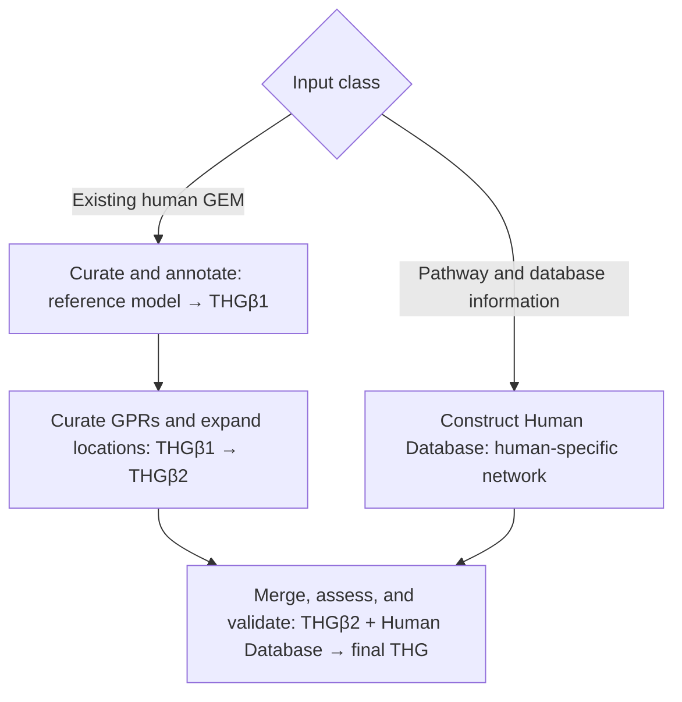

# THG protocol overview

!!! warning "Scope and evidence"
    Maintained operations and a restartable engineering DAG exist. Complete
    published THG construction and final-artifact reproduction are Not
    implemented and Not yet verified.

## Purpose and intended audience

This is the canonical route for researchers who want to understand or compose
the published construction strategy. It separates the scientific sequence from
the package's modular operations. A GEM is a genome-scale metabolic model;
Human1 is the reference GEM used by the publication; THG is the resulting Human
GEM concept.

## The complete workflow

The left/reference branch starts with an existing human GEM such as Human1.
Reference annotation and mass-balance curation produce the conceptual THGβ1
state. GPR/location curation and isoenzyme-based expansion produce THGβ2. The
other branch gathers human pathways and online biological information into a
Human Database/network containing metabolites, reactions, genes, GPRs, and
compartments. The branches converge during merge. MEMOTE/task assessment and
package stoichiometric-consistency checks are separate validation activities.

The diagram is the publication's conceptual workflow, not a claim that the
current package emits all named files automatically.

## The two construction branches

### Reference model branch

The [reference-model route](reference-model.md) preserves a caller-owned
existing model, inspects and enriches identifiers, treats mass-balance issues,
and then composes GPR/location helpers. It corresponds to the Human1-like
starting point described in the publication.

### Human Database branch

The [Human Database route](human-database.md) explains the publication's
pathway-driven information gathering and the current package's boundary:
normalized records can be reconstructed deterministically, while a complete
live harvesting orchestrator is Not implemented.

## Intermediate model states

| Stage | Starting material | Main transformation | Result in the publication |
| --- | --- | --- | --- |
| Reference curation | Existing human GEM, such as Human1 | Improve identifiers/annotation and correct mass-balance issues | THGβ1 |
| GPR/location expansion | Curated reference model | Curate GPRs and add compartment-specific isoenzyme reactions | THGβ2 |
| Human Database construction | Human pathway and online database information | Build a human-specific network with metabolites, reactions, genes, GPRs, and compartments | Human Database |
| Merge | THGβ2 and Human Database | Identify overlap and combine compatible content | Merged candidate THG |
| Assessment and consistency | Merged candidate | MEMOTE, essential tasks, and stoichiometric consistency checks | Final THG |

The publication uses these names as intermediate model states. The refactored
package does not formally name every output THGβ1/THGβ2, so those names are used
here for conceptual mapping only.

## Merge and validation loop

Merge the two preserved inputs, review the structured merge report, and run
connectivity, formula-balance, and stoichiometric-consistency checks. MEMOTE is
an [external operation](../workflows/memote.md), not an installed THG API.
Essential metabolic-task analysis from the historical publication workflow is
recorded as Archived unless a maintained replacement is demonstrated.

## Requirements by stage

| Stage | Local inputs | Possible external requirements |
| --- | --- | --- |
| Reference curation | JSON/SBML model and explicit output paths | Network/client credentials for live identifiers or GPR lookups |
| GPR/location expansion | Model rules, gene identifiers, injected clients | BioCyc, KEGG, Ensembl/location service access where lookups are used |
| Human Database | Normalized JSON records or explicit record objects | Service clients for enrichment; historical pickle input needs `database` extra |
| Merge and checks | Two compatible COBRA models | Solver for solver-backed checks; MEMOTE installed separately |

## Current implementation status

Use the [capability and evidence status](capability-status.md) as the authoritative
user-facing status record. In short, reconstruction, merge, local analysis,
pathway, gapfill, and several annotation helpers are maintained interfaces;
the complete published orchestration is Not implemented, MEMOTE is an External
integration, and the historical task workflow is Archived. See the evidence
registry for the operation-level records.

## Workflow entry points

- Existing human GEM: [reference-model branch](reference-model.md).
- Human pathway/database records: [Human Database branch](human-database.md).
- Two prepared branches: [merge and validation](merge-and-validate.md).
- Small offline software demonstration: [worked end-to-end example](end-to-end-example.md).
- Restartable API composition: [resumable engineering runs](../workflows/resumable-run.md).
- One operation: [operation reference](../usage.md).
